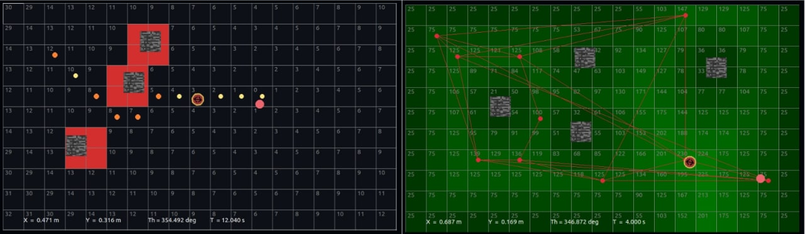

# path-planning

Path-planning algorithms application and visualization.




## Installation 

Create an anaconda environment

```bash
conda create --name robotics python=3.9
```

And activate the new environment

```bash
conda activate robotics
```

Now go inside the root root folder and install the library: 

```bash
pip install -e .
```


## Running the software

Once the environment is activated and the library installed, run the following command: 

```bash
path-planning
```

## Running PHIDIAS task

Install PHIDIAS from [here](https://github.com/LemuelPuglisi/phidias) in the same environment.

Then run the program using the `phidias` flag:

```bash
path-planning --phidias
```

The program will be freezed until a PHIDIAS client connects to it. Open  another terminal with the same env, then run:

```bash
path-planning-strategy
```

This will pop-up a PHIDIAS terminal where you can run the `connect()` proactive procedure and unfreeze the program.
Add items using the buttons and then run the `pick()` proactive procedure to run the strategy.

